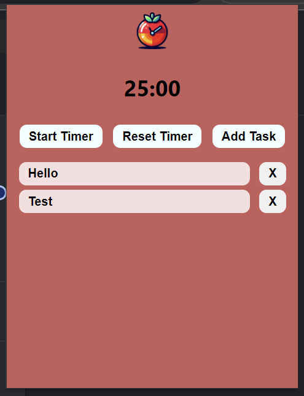
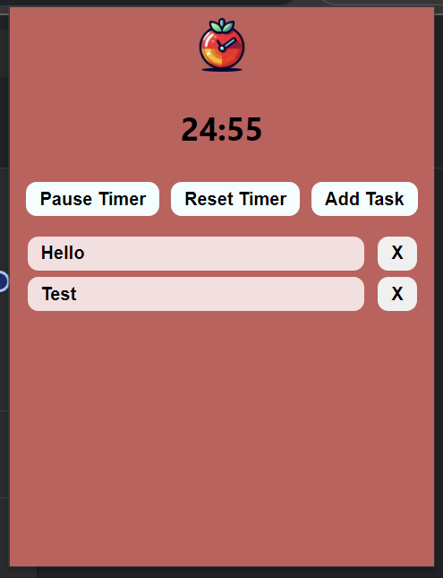
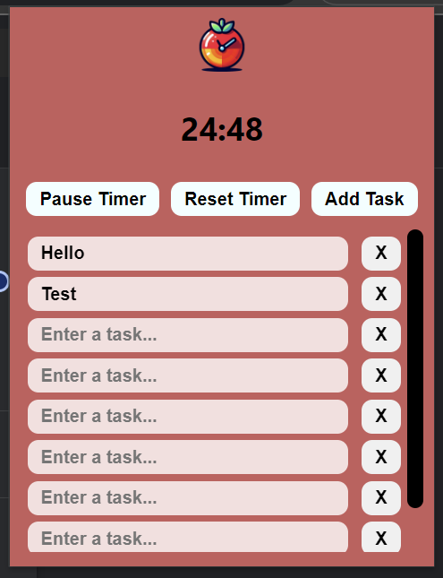

# pomodoro-timer-study

A Pomodoro Timer Extension For the Chrome. This is a study project.

## About the project

This project was created for study purposes on extensions for Google Chrome/Microsoft Edge, which aims to aid in focus using the Pomodoro technique. This technique is essentially "a time management method based on 25-minute periods (pomodoros) of focused study or work, interrupted by 5-minute breaks."

The functionalities of this extension include:

- Setting the duration for the Pomodoro period.
- Starting, pausing, and resetting the Pomodoro timer.
- Creating tasks to remember what needs to be done.

Within these functionalities, the following Chrome features were used:

- **Storage**: Used to save and read data stored in the browser.
- **Alarms**: To create alarms that notify at the defined period.
- **Notifications**: To create notifications to alert the user, in this case, when the defined time for the period is over.

Below, some screenshots of the extension:

